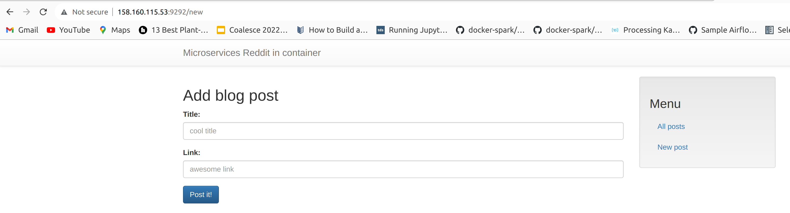
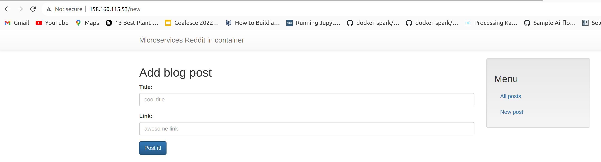

### create vpc, subnet, security group and app + db instances
```
cd terraform/stage/modules/vpc
# this will create vpc and security group
terraform apply -var-file=terraform.tfvars

cd ../../stage
# this will fetch security group id and subnet id with data block as passing through variables doesn't work
terraform apply -var-file=terraform.tfvars

Outputs:

external_ip_address_app = "158.160.115.53"
external_ip_address_db = "158.160.126.90"
internal_ip_address_app = "192.168.10.12"
internal_ip_address_db = "192.168.10.17"
```
### modify ansible/environments/stage/inventory.ini or ansible/environments/prod/inventory.ini file:
```
[app]
appserver ansible_host=158.160.115.53 ansible_user=ubuntu ansible_internal_ip=192.168.10.12

[db]
dbserver ansible_host=158.160.126.90 ansible_user=ubuntu ansible_internal_ip=192.168.10.17
```

### run ansible playbook (takes a realy long time as it builds ancient Python 3.6.15 from source)
```
cd ../../ansible
# this won't work:
ansible-playbook -i environments/stage/inventory playbooks/site.yml

# it only works with full path specified:
ansible-playbook -i /media/groot/data/arybach_infra/ansible/environments/stage/inventory.ini ./playbooks/site.yml

or
# this won't work:
ansible-playbook -i environments/prod/inventory playbooks/site.yml

# it only works with full path specified:
ansible-playbook -i /media/groot/data/arybach_infra/ansible/environments/prod/inventory.ini ./playbooks/site.yml
```
### output
```
...
TASK [app : Fetch the latest version of application code] ***********************************************************************************************************
>> Newly checked out 0a4d3a148dccd6fd3e536b70ac8665c296efe159
changed: [appserver]

TASK [app : Install specified python requirements for Python 3] *****************************************************************************************************
changed: [appserver]

TASK [app : Add config for DB connection] ***************************************************************************************************************************
--- before
+++ after: /home/groot/.ansible/tmp/ansible-local-142927og5spg3m/tmplyove8r5/db_config.j2
@@ -0,0 +1 @@
+DATABASE_URL=mongodb://192.168.10.17

changed: [appserver]

TASK [app : Add COMMENT_DATABASE_HOST to .bashrc] *******************************************************************************************************************
--- before: /home/ubuntu/.bashrc (content)
+++ after: /home/ubuntu/.bashrc (content)
@@ -113,5 +113,6 @@
     . /usr/share/bash-completion/bash_completion
   elif [ -f /etc/bash_completion ]; then
     . /etc/bash_completion
   fi
 fi
+export COMMENT_DATABASE_HOST=192.168.10.17

changed: [appserver]

TASK [app : Add POST_DATABASE_HOST to .bashrc] **********************************************************************************************************************
--- before: /home/ubuntu/.bashrc (content)
+++ after: /home/ubuntu/.bashrc (content)
@@ -114,5 +114,6 @@
   elif [ -f /etc/bash_completion ]; then
     . /etc/bash_completion
   fi
 fi
 export COMMENT_DATABASE_HOST=192.168.10.17
+export POST_DATABASE_HOST=192.168.10.17

changed: [appserver]

TASK [app : Bundle install for the UI service] **********************************************************************************************************************
changed: [appserver]

TASK [app : Copy Puma service file] *********************************************************************************************************************************
--- before
+++ after: /media/groot/data/arybach_infra/ansible/roles/app/files/puma.service
@@ -0,0 +1,14 @@
+[Unit]
+Description=Puma HTTP Server
+After=network.target
+
+[Service]
+Type=simple
+EnvironmentFile=/home/ubuntu/db_config
+User=ubuntu
+WorkingDirectory=/home/ubuntu/reddit/ui
+ExecStart=/bin/bash -lc 'puma'
+Restart=always
+
+[Install]
+WantedBy=multi-user.target

changed: [appserver]

TASK [app : Enable and start Puma service] **************************************************************************************************************************
changed: [appserver]

RUNNING HANDLER [app : reload puma] *********************************************************************************************************************************
changed: [appserver]

PLAY RECAP **********************************************************************************************************************************************************
appserver                  : ok=23   changed=19   unreachable=0    failed=0    skipped=0    rescued=0    ignored=0
dbserver                   : ok=9    changed=4    unreachable=0    failed=0    skipped=0    rescued=0    ignored=0
```

### open appserver ip port 9292 with web browser
everything works except for the comments - bug in the https://github.com/express42/reddit.git repo (branch microservices)



### add users and encrypt keys
```
cd ../../ansible

ansible-vault encrypt environments/prod/credentials.yml
> Encryption successful

ansible-vault encrypt environments/stage/credentials.yml
> Encryption successful
```
### then run
ansible-playbook -i /media/groot/data/arybach_infra/ansible/environments/stage/inventory.ini ./playbooks/users.yml

### output
```
TASK [create users] *************************************************************************************************************************************************
[DEPRECATION WARNING]: Encryption using the Python crypt module is deprecated. The Python crypt module is deprecated and will be removed from Python 3.13. Install
the passlib library for continued encryption functionality. This feature will be removed in version 2.17. Deprecation warnings can be disabled by setting
deprecation_warnings=False in ansible.cfg.
[DEPRECATION WARNING]: Encryption using the Python crypt module is deprecated. The Python crypt module is deprecated and will be removed from Python 3.13. Install
the passlib library for continued encryption functionality. This feature will be removed in version 2.17. Deprecation warnings can be disabled by setting
deprecation_warnings=False in ansible.cfg.
changed: [appserver] => (item={'key': 'admin', 'value': {'password': 'qwerty123', 'groups': 'sudo'}})
changed: [dbserver] => (item={'key': 'admin', 'value': {'password': 'qwerty123', 'groups': 'sudo'}})
changed: [appserver] => (item={'key': 'qauser', 'value': {'password': 'test123'}})
changed: [dbserver] => (item={'key': 'qauser', 'value': {'password': 'test123'}})

PLAY RECAP **********************************************************************************************************************************************************
appserver                  : ok=2    changed=1    unreachable=0    failed=0    skipped=0    rescued=0    ignored=0
dbserver                   : ok=2    changed=1    unreachable=0    failed=0    skipped=0    rescued=0    ignored=0
```

### check the vm
```
ssh -i ~/.ssh/yc ubuntu@158.160.115.53

cat /etc/passwd | grep qauser
qauser:x:1002:1003::/home/qauser:
```

### install nginx community role
ansible-galaxy install -r environments/stage/requirements.yml

```
Starting galaxy role install process
- downloading role 'nginx', owned by jdauphant
- downloading role from https://github.com/jdauphant/ansible-role-nginx/archive/v2.21.1.tar.gz
- extracting jdauphant.nginx to /media/groot/data/arybach_infra/ansible/roles/jdauphant.nginx
- jdauphant.nginx (v2.21.1) was installed successfully
```
### run nginx playbook
```
ansible-playbook -i /media/groot/data/arybach_infra/ansible/environments/stage/inventory.ini ./playbooks/nginx.yml
```
### after that the app opens on the ip port 80:


### clean up:
```
cd ../terraform/stage
terraform destroy -var-file=terraform.tfvars

cd ../modules/vpc
terraform destroy -var-file=terraform.tfvars
```
