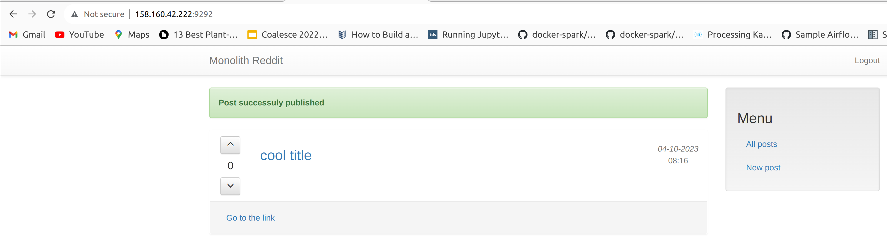

### db module is not needed here as we are deploying monolith repo to appserver
```
cd terraform/stage
terraform apply -var-file=terraform.tfvars

Outputs:

external_ip_address_app = "158.160.42.222"
external_ip_address_db = "158.160.96.120"
internal_ip_address_app = "10.128.0.20"
internal_ip_address_db = "10.128.0.33"
```

### modify ansible/inventory.ini file:
```
[app]
appserver ansible_host=158.160.42.222

[db]
dbserver ansible_host=158.160.96.120
```

### check ansible playbook
```
[0] % ansible-playbook reddit_app.yml --check --limit db

PLAY [Configure hosts & deploy application] **********************************************************************************************************

TASK [Gathering Facts] *******************************************************************************************************************************
ok: [dbserver]

TASK [Change mongo config file] **********************************************************************************************************************
changed: [dbserver]

RUNNING HANDLER [restart mongod] *********************************************************************************************************************
changed: [dbserver]

PLAY RECAP *******************************************************************************************************************************************
dbserver                   : ok=3    changed=2    unreachable=0    failed=0    skipped=0    rescued=0    ignored=0
```

### after adding puma.service file and puma tasks to reddit_app.yml:

```
[0] % yc compute instance list | grep 158.160.96.120
| fhmmr7aqbffvb513ffnc | reddit-db     | ru-central1-a | RUNNING | 158.160.96.120 | 10.128.0.33 |
# then copy internal ip 10.128.0.33 to db_host var in reddit_app/yml
# Note: for monolith repo we would set db_host to 10.128.0.20 - as it's running on the localhost

% ansible-playbook reddit_app.yml --limit app --tags app-tag

PLAY [Configure hosts & deploy application] **********************************************************************************************************

TASK [Gathering Facts] *******************************************************************************************************************************
ok: [appserver]

TASK [Copy Puma service file] ************************************************************************************************************************
changed: [appserver]

TASK [Add config for DB connection] ******************************************************************************************************************
changed: [appserver]

RUNNING HANDLER [reload systemd] *********************************************************************************************************************
changed: [appserver]

PLAY RECAP *******************************************************************************************************************************************
appserver                  : ok=4    changed=3    unreachable=0    failed=0    skipped=0    rescued=0    ignored=0
```
### after adding bundle install and cloning reddit git repo tasks to reddit_app.yml:

```
% ansible-playbook reddit_app.yml --limit app --tags deploy-tag

PLAY [Configure hosts & deploy application] **********************************************************************************************************

TASK [Gathering Facts] *******************************************************************************************************************************
ok: [appserver]

TASK [Install git] ***********************************************************************************************************************************
changed: [appserver]

TASK [Fetch the latest version of application code] **************************************************************************************************
changed: [appserver]

TASK [Bundle install] ********************************************************************************************************************************
changed: [appserver]

RUNNING HANDLER [reload puma] ************************************************************************************************************************
ok: [appserver]

PLAY RECAP *******************************************************************************************************************************************
appserver                  : ok=5    changed=3    unreachable=0    failed=0    skipped=0    rescued=0    ignored=0
```

### run without tags for proper deploy
```
% ansible-playbook reddit_app.yml
```

